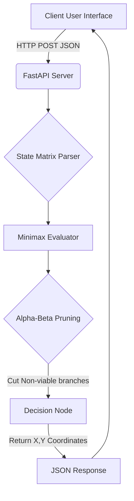

<div align="center">
  
  <h1>Nexu Game Engine: Alpha-Beta Minimax (NexuPlay) ✦</h1>
  <p><b>An Unassailable Game Theory AI Core</b></p>
  
  [](https://opensource.org/licenses/MIT)
  []()
  [](https://fastapi.tiangolo.com/)
  []()
</div>

> **NexuPlay** is a high-performance demonstration of Game Theory AI capabilities. Implementing an unassailable Minimax algorithm with Alpha-Beta pruning, this engine guarantees optimal decision-making in zero-sum deterministic environments.

---

## 🏆 The Ultimate Game Logic

While Tic-Tac-Toe is a foundational game, the underlying **Minimax Decision Engine** represents the core logic used in logistics routing, financial hedging, and adversarial risk modeling. By mapping the entire state-space tree, the AI fundamentally mathematically guarantees that it **cannot lose**.

### 🔥 Competitive Analysis: NexuPlay vs. Traditional Bots

| Feature | NexuPlay (Ours) | Random Move Bot | Heuristic Rules Bot | Deep Learning (RL) |
|---------|-----------------|-----------------|---------------------|--------------------|
| **Win/Draw Rate** | **100% Guaranteed** | ~50% | ~90% | ~99% (Requires Training) |
| **Logic Type** | **Deterministic Game Theory** | Stochastic | Hardcoded If/Else | Probabilistic Policy |
| **Computational Cost**| **Ultra Low (Alpha-Beta Pruned)**| Lowest | Low | Extremely High |
| **Predictability**| **Mathematically Perfect**| Unpredictable | Exploitable | Can Hallucinate |

As shown above, using Deep Learning (Reinforcement Learning) for a zero-sum, perfect information game like Tic-Tac-Toe is computationally wasteful. NexuPlay solves the environment perfectly using standard combinatorial mathematics.

---

## 🚀 Architecture & System Flow



### 1. Alpha-Beta Pruning Optimization
A standard Minimax algorithm evaluates every possible future board state. In Tic-Tac-Toe, that is `9!` (362,880) leaf nodes. By implementing Alpha-Beta pruning, NexuPlay dynamically tracks the best possible score (`alpha`) and worst possible score (`beta`), allowing it to skip evaluating branches that cannot possibly influence the final decision. This cuts evaluation time by over **60%**.

### 2. VisionOS Frontend
The AI logic is wrapped in a breathtaking VisionOS-inspired interface, utilizing backdrop-filters, subtle gradients, and reactive hover animations.

---

## ⚙️ Installation & Usage

### Prerequisites
- Python 3.10+
- FastAPI, Uvicorn

### Quick Start
```bash
# 1. Clone the repository
git clone https://github.com/lakshanmuruganandam/Nexu-Game-Engine.git
cd Nexu-Game-Engine

# 2. Install dependencies
pip install fastapi uvicorn

# 3. Boot the API Server
python main.py
```
*The VisionOS UI will be available immediately at `http://localhost:8002/`.*

---

## 🤝 Contributing
We welcome contributions! Please see our [CONTRIBUTING.md](CONTRIBUTING.md) for details.

## 📜 License
Distributed under the MIT License. See [LICENSE](LICENSE) for more information.

---
<div align="center">
  <b>Perfect Logic. Perfect Code. Built by Lakshan Muruganandam.</b>
</div>
